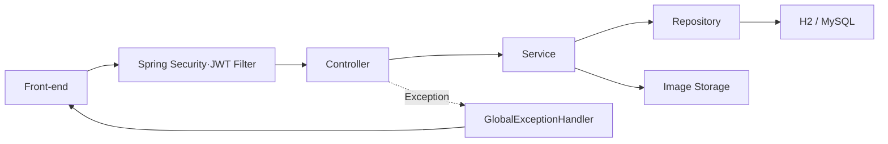
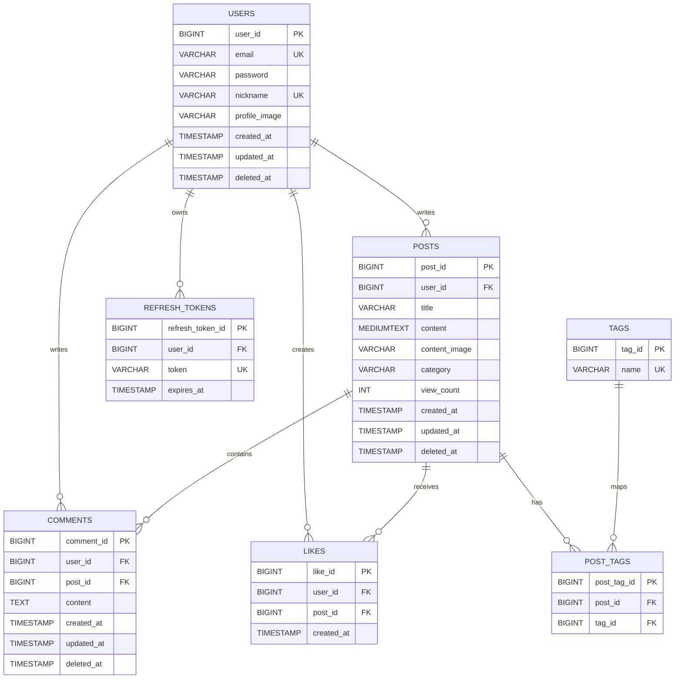

# 📚 배움잇다

> 각자 배운 내용을 기록하고, 그 기록을 통해 사람과 사람의 배움을 잇는다는 의미를 담은 커뮤니티 서비스입니다.

## Back-end 소개

- `Java 21`과 `Spring Boot`로 REST API 서버를 구현했습니다.
- 로컬 환경은 `H2`, Docker 및 배포 환경은 데이터 영속성을 위해 `MySQL`을 사용합니다.
- 회원 인증, 게시글·댓글 CRUD, 좋아요, 검색·정렬·페이지네이션, 이미지 업로드 기능을 제공합니다.
- Controller–Service–Repository 계층으로 역할을 분리하고 JPA와 QueryDSL로 데이터를 조회합니다.
- Docker, Nginx, GitHub Actions를 활용해 Blue/Green 방식으로 배포했습니다.

### 링크

- 배포 주소: http://43.201.115.172
- Front-end GitHub: https://github.com/100-hours-a-week/KTB4_Elin_Week12_FE
- Back-end GitHub: https://github.com/100-hours-a-week/KTB4_Elin_Week12_BE

### 개발 인원 및 기간

- 개발 기간: 2026-05-28 ~ 2026-08-09
- 개발 인원: 프론트엔드/백엔드 1명 (본인)

### 사용 기술 및 Tools

| 구분 | 사용 기술 |
|---|---|
| Language | Java 21 |
| Framework | Spring Boot 4.0.6, Spring MVC, Spring Security |
| Data | Spring Data JPA, QueryDSL 5.1, MySQL 8.4, H2 |
| Authentication | JWT, BCrypt, HttpOnly Cookie |
| Test | JUnit 5, Mockito, Spring Boot Test |
| Build | Gradle 9.5.1 |
| Deployment | Docker, Nginx, GitHub Actions, Blue/Green Deployment |
| Version Control | Git, GitHub |

## 목차

- [폴더 구조](#폴더-구조)
- [서버 설계](#서버-설계)
- [주요 기능](#주요-기능)
- [API](#api)
- [데이터베이스 설계](#데이터베이스-설계)
- [로컬 실행 방법](#로컬-실행-방법)
- [테스트 및 검증](#테스트-및-검증)
- [CI/CD](#cicd)
- [트러블 슈팅 및 개선](#트러블-슈팅-및-개선)
- [프로젝트 후기](#프로젝트-후기)

## 폴더 구조

<details>
  <summary>폴더 구조 보기/숨기기</summary>
  <div markdown="1">

```text
.
├── .github
│   └── workflows
│       └── ci-be.yml
├── deploy
│   └── direct
│       ├── community-api.service
│       ├── community.env.example
│       └── nginx.conf
├── gradle
│   └── wrapper
│       ├── gradle-wrapper.jar
│       └── gradle-wrapper.properties
├── src
│   ├── main
│   │   ├── java/community/api
│   │   │   ├── auth
│   │   │   ├── config
│   │   │   ├── controller
│   │   │   ├── dto
│   │   │   ├── entity
│   │   │   ├── exception
│   │   │   ├── handler
│   │   │   ├── repository
│   │   │   ├── response
│   │   │   ├── service
│   │   │   └── ApiApplication.java
│   │   └── resources
│   │       ├── application.yaml
│   │       ├── data.sql
│   │       └── schema.sql
│   └── test
│       └── java/community/api
│           ├── service
│           │   ├── CommentServiceTest.java
│           │   ├── ImageServiceTest.java
│           │   ├── PostServiceTest.java
│           │   ├── UserLoginTest.java
│           │   ├── UserProfileTest.java
│           │   ├── UserRegisterTest.java
│           │   └── UserUpdateTest.java
│           └── ApiApplicationTests.java
├── .dockerignore
├── .env.example
├── .gitignore
├── Dockerfile
├── README.md
├── build.gradle
├── docker-compose.yml
├── gradlew
├── gradlew.bat
└── settings.gradle
```

  </div>
</details>

## 서버 설계

### 서버 구조



| 도메인 | Controller | Service | Repository |
|---|---|---|---|
| 회원·인증 | `UserController` | `UserService` | `UserRepository`, `RefreshTokenRepository` |
| 게시글 | `PostController` | `PostService` | `PostRepository`, `PostTagRepository`, `TagRepository` |
| 댓글 | `CommentController` | `CommentService` | `CommentRepository` |
| 좋아요 | `LikeController` | `LikeService` | `LikeRepository` |
| 이미지 | `ImageController` | `ImageService` | 파일 시스템 |
| 상태 확인 | `HealthController` | - | `JdbcTemplate` |

- 인증된 사용자 ID는 JWT 필터에서 검증한 뒤 `@AuthenticationPrincipal`로 Controller에 전달합니다.
- Service는 트랜잭션과 비즈니스 규칙을 처리하고 Repository는 데이터 조회와 저장을 담당합니다.
- 데이터를 반환하는 API는 `{ "message": "...", "data": ... }` 형식을 사용하고 예외는 `GlobalExceptionHandler`에서 처리합니다. 삭제 성공은 `204 No Content`, health check는 상태 정보를 별도로 반환합니다.

## 주요 기능

### 회원·인증

- 이메일·닉네임 중복 확인과 BCrypt 비밀번호 암호화를 적용했습니다.
- Access Token은 응답으로, Refresh Token은 HttpOnly Cookie로 발급합니다.
- Refresh Token을 DB에 저장하고 재발급 시 기존 토큰을 삭제하는 rotation 방식을 사용합니다.
- Spring Security를 stateless로 설정하고 JWT 인증이 필요한 요청을 보호합니다.
- 프로필·비밀번호 수정, 로그아웃과 soft delete 방식의 회원 탈퇴를 지원합니다.

### 게시글

- 게시글 작성·조회·수정·soft delete와 작성자 권한 검증을 지원합니다.
- 카테고리, 최대 5개 태그, 이미지와 조회수를 관리합니다.
- QueryDSL로 키워드·카테고리·태그 검색과 최신순·오래된순·조회수순·좋아요순 정렬을 구현했습니다.
- `Pageable`로 offset·limit과 전체 건수를 반환하며 한 번에 최대 50개까지 요청할 수 있습니다.
- 목록 조회 시 작성자를 fetch join하고 좋아요·댓글 수, 태그, 현재 사용자의 좋아요 여부를 게시글 ID 목록으로 배치 조회합니다.

### 좋아요·댓글

- 게시글별 좋아요 등록·취소와 중복 좋아요 방지를 지원합니다.
- 좋아요한 게시글은 `likes.created_at DESC`, `like_id DESC` 기준으로 최신순 조회하고 삭제된 게시글은 제외합니다.
- 댓글 등록·조회·수정·soft delete와 작성자 권한 검증을 지원합니다.
- 탈퇴한 작성자의 게시글과 댓글은 사용자 정보를 노출하지 않고 `탈퇴한 사용자`로 응답합니다.

### 이미지·상태 확인

- JPEG와 PNG 이미지를 UUID 파일명으로 저장하고 `/uploads/**` 경로로 제공합니다.
- 업로드 크기는 최대 10MB로 제한합니다.
- `/health`에서 애플리케이션뿐 아니라 DB에 `SELECT 1`을 실행해 연결 상태도 함께 확인합니다.

## API

> 로그인·회원가입·토큰 재발급·이미지 업로드·업로드 이미지 조회·health check를 제외한 요청에는 Access Token이 필요합니다.

### 회원

| Method | Endpoint | 설명 |
|---|---|---|
| `POST` | `/users` | 회원가입 |
| `POST` | `/users/sessions` | 로그인 |
| `DELETE` | `/users/sessions` | 로그아웃 |
| `POST` | `/users/token/refresh` | Access/Refresh Token 재발급 |
| `GET` | `/users/profile` | 내 프로필 조회 |
| `PATCH` | `/users/profile` | 프로필 수정 |
| `DELETE` | `/users/profile` | 회원 탈퇴 |
| `PATCH` | `/users/password` | 비밀번호 수정 |

### 게시글·댓글·좋아요

| Method | Endpoint | 설명 |
|---|---|---|
| `GET` | `/posts` | 검색·정렬·페이지네이션 게시글 목록 |
| `POST` | `/posts` | 게시글 작성 |
| `GET` | `/posts/liked` | 현재 사용자가 좋아요한 게시글 목록 |
| `GET` | `/posts/{postId}` | 게시글 상세 조회 및 조회수 증가 |
| `PATCH` | `/posts/{postId}` | 게시글 수정 |
| `DELETE` | `/posts/{postId}` | 게시글 삭제 |
| `GET` | `/posts/{postId}/comments` | 댓글 목록 |
| `POST` | `/posts/{postId}/comments` | 댓글 등록 |
| `PATCH` | `/posts/{postId}/comments/{commentId}` | 댓글 수정 |
| `DELETE` | `/posts/{postId}/comments/{commentId}` | 댓글 삭제 |
| `POST` | `/posts/{postId}/likes` | 좋아요 등록 |
| `DELETE` | `/posts/{postId}/likes` | 좋아요 취소 |
| `POST` | `/images` | 이미지 업로드 |
| `GET` | `/uploads/{fileName}` | 업로드 이미지 조회 |
| `GET` | `/health` | 애플리케이션·DB 상태 확인 |

게시글 목록 요청 예시:

```http
GET /posts?keyword=spring&category=BACKEND&tags=jpa&sort=LATEST&page=0&size=10
Authorization: Bearer <ACCESS_TOKEN>
```

## 데이터베이스 설계

### 테이블 구성

| 테이블 | 역할 |
|---|---|
| `users` | 이메일, 암호화된 비밀번호, 닉네임, 프로필과 탈퇴 일시 관리 |
| `posts` | 작성자, 제목, 본문, 이미지, 카테고리, 조회수와 삭제 일시 관리 |
| `comments` | 게시글별 댓글과 삭제 일시 관리 |
| `likes` | 사용자와 게시글의 좋아요 관계 및 좋아요 생성 일시 관리 |
| `refresh_tokens` | 사용자별 Refresh Token과 만료 일시 관리 |
| `tags` | 중복되지 않는 태그 이름 관리 |
| `post_tags` | 게시글과 태그의 다대다 관계 연결 |

### E-R Diagram



- `users.email`, `users.nickname`, `tags.name`에는 UNIQUE 제약조건을 적용했습니다.
- `likes`는 `(user_id, post_id)`, `post_tags`는 `(post_id, tag_id)` 조합의 중복을 방지합니다.
- 사용자·게시글·댓글은 `deleted_at`으로 soft delete 처리합니다.

## 로컬 실행 방법

### 1. 요구 사항

- Java 21
- Git
- Docker 및 Docker Compose — MySQL 환경으로 실행할 경우

### 2. 저장소 클론

```bash
git clone https://github.com/100-hours-a-week/KTB4_Elin_Week12_BE.git
cd KTB4_Elin_Week12_BE
chmod +x gradlew
```

### 3. H2로 실행

기본 설정은 인메모리 H2를 사용합니다. 충분히 긴 JWT Secret을 환경변수로 전달합니다.

```bash
JWT_SECRET='replace-with-a-random-secret-at-least-32-characters' \
./gradlew bootRun
```

- API 기본 주소: `http://localhost:8080`
- 애플리케이션을 재시작하면 H2 데이터는 초기화됩니다.

### 4. MySQL과 Docker로 실행

```bash
cp .env.example .env
```

`.env`에서 다음 값을 실제 환경에 맞게 변경합니다.

```env
JWT_SECRET=replace-with-a-random-secret-at-least-32-characters
COOKIE_SECURE=false
MYSQL_PASSWORD=replace-with-a-mysql-password
MYSQL_ROOT_PASSWORD=replace-with-a-root-password
UPLOAD_DIR=./runtime/uploads
```

```bash
docker compose up -d --build
docker compose ps
docker compose exec backend curl -fsS http://localhost:8080/health
```

- 현재 `docker-compose.yml`은 Back-end 포트를 호스트에 공개하지 않고 Docker 네트워크 내부에만 `expose`합니다. 외부 요청은 배포 서버의 Nginx를 통해 전달됩니다.
- `.env`와 실제 비밀번호·키는 Git에 커밋하지 않습니다.
- 배포 환경에서 HTTPS를 사용하면 `COOKIE_SECURE=true`로 설정합니다.

## 테스트 및 검증

JUnit 5와 Mockito로 Service 계층의 정상·예외 흐름을 검증하고, GitHub Actions에서 전체 테스트와 빌드를 실행했습니다.

| 테스트 | 주요 검증 내용 |
|---|---|
| `UserRegisterTest` | 비밀번호 암호화, 회원가입 응답, 이메일·닉네임 중복 |
| `UserLoginTest` | 로그인, Refresh Token 저장·rotation·만료, 로그아웃 |
| `UserProfileTest` | 프로필 조회, 미인증·미존재·탈퇴 사용자 처리 |
| `UserUpdateTest` | 프로필·비밀번호 수정과 회원 탈퇴 예외 처리 |
| `PostServiceTest` | 작성자 권한, 삭제 게시글, 검색 결과, 댓글 수, 좋아요 최신순 |
| `CommentServiceTest` | 댓글 삭제와 삭제 댓글 제외 |
| `ImageServiceTest` | 빈 파일, 이미지가 아닌 파일, 지원하지 않는 형식 거부 |
| `ApiApplicationTests` | Spring Application Context 로딩 |

```bash
./gradlew clean test --no-daemon
```

## CI/CD

`main` 브랜치에 push하면 GitHub Actions가 다음 순서로 실행됩니다.

1. Java 21 환경에서 Gradle 테스트와 `bootJar` 빌드를 실행합니다.
2. Docker 이미지를 `latest`와 commit SHA 태그로 Docker Hub에 push합니다.
3. EC2의 비활성 Blue/Green 컨테이너를 실행합니다.
4. `/health`에서 애플리케이션과 DB 연결을 확인합니다.
5. 성공하면 Nginx 트래픽을 새 환경으로 전환하고 기존 컨테이너를 중지합니다.
6. 실패하면 새 컨테이너를 중지하고 기존 환경을 유지합니다.

Docker 실행 시 JVM 메모리를 제한하고 이미지 업로드 경로를 volume으로 연결해 배포 후에도 파일을 유지합니다.

## 트러블 슈팅 및 개선

| 문제 | 개선 |
|---|---|
| 인메모리 H2는 애플리케이션 재시작 시 데이터가 초기화됨 | 로컬 기본 환경은 H2로 유지하고 Docker·배포 환경은 MySQL을 사용하도록 환경변수 기반으로 분리했습니다. |
| MySQL 연결 timeout 이후 Nginx에서 502 발생 | 컨테이너 로그와 대상 상태를 확인하고, EC2 사설 통신·보안 그룹 3306·DB 연결을 `nc`와 `/health`로 단계별 검증했습니다. |
| 게시글 목록에서 작성자·태그·좋아요 여부를 건별로 조회함 | 작성자는 fetch join하고 나머지는 게시글 ID 목록으로 배치 조회해 목록 쿼리 수를 줄였습니다. |
| 검색 조건에 맞는 게시글을 제한 없이 모두 조회함 | QueryDSL 조회에 `Pageable`의 offset·limit과 count query를 적용했습니다. |

## 프로젝트 후기

이번 프로젝트를 통해 Controller, Service, Repository의 책임을 구분하고, 인증·권한 검증과 데이터 접근 로직을 분리하는 방법을 익혔습니다. 또한 soft delete, 좋아요 생성 시간, JWT 발급·재발급·폐기 흐름을 구현하며 기능뿐만 아니라 데이터의 상태와 인증 수명주기까지 고려해야 한다는 점을 배웠습니다.

개발 환경에서는 H2를 사용하고, 데이터 영속성이 필요한 Docker·배포 환경에서는 MySQL을 사용하도록 분리했습니다. 배포 중에는 DB 연결 timeout과 Nginx 502를 경험했고, 애플리케이션 로그부터 컨테이너, 포트, 네트워크를 순서대로 확인하며 문제의 원인을 좁혀가는 방법도 익혔습니다.

초반에는 기능 구현에 집중해 이후 구조와 조회 방식을 다시 개선하는 데 예상보다 많은 시간이 들었습니다. 앞으로는 개발 전에 기존 코드의 흐름, 데이터 변경 범위와 실패 조건을 먼저 정리하고 테스트 기준까지 함께 준비하려고 합니다.
